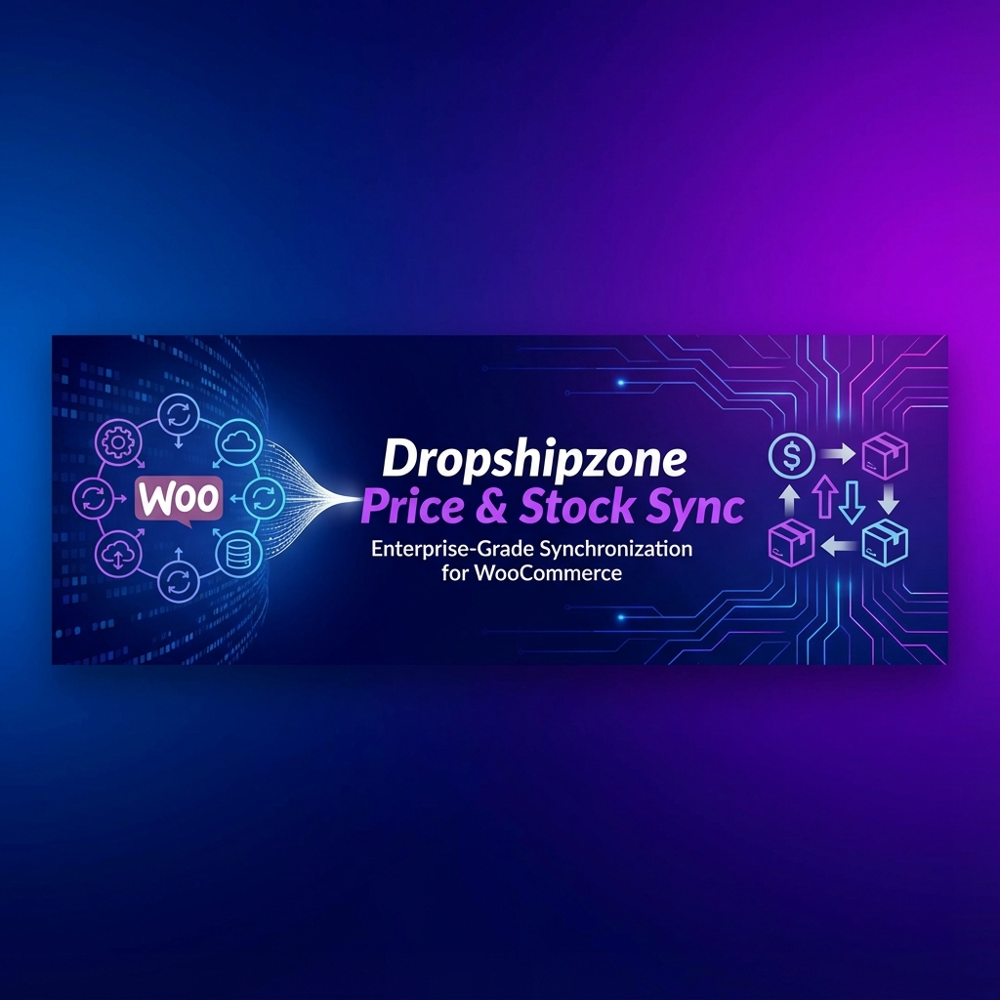

# Dropshipzone Price & Stock Sync




A lightweight, enterprise-grade WooCommerce plugin that automatically synchronizes product prices and stock levels from the Dropshipzone API.

## ✨ Features

- **🔄 Price Sync** - Automatically update regular and sale prices
- **📦 Stock Sync** - Keep stock quantities accurate in real-time
- **🏷️ SKU Matching** - Products matched by SKU for accuracy
- **💰 Flexible Pricing** - Percentage or fixed markup options
- **🧮 GST Support** - Include or exclude 10% Australian GST
- **🔢 Price Rounding** - Round to .99, .95, or nearest dollar
- **🛡️ Stock Buffer** - Subtract units to prevent overselling
- **⏰ Scheduled Sync** - Hourly, twice daily, or daily options
- **▶️ Manual Sync** - Run sync anytime with one click
- **📊 Batch Processing** - Handles 10,000+ products efficiently
- **📝 Detailed Logging** - Track all sync activity and errors
- **🎨 Modern UI** - Beautiful, responsive admin interface

## 📋 Requirements

- WordPress 5.8 or higher
- WooCommerce 5.0 or higher
- PHP 7.4 or higher
- Dropshipzone API account

## 🚀 Installation

### From WordPress Admin

1. Download the latest release `.zip` file
2. Go to **Plugins > Add New > Upload Plugin**
3. Upload the zip file and click **Install Now**
4. Activate the plugin

### Manual Installation

1. Download and extract the plugin
2. Upload the `dropshipzone` folder to `/wp-content/plugins/`
3. Activate through the **Plugins** menu in WordPress

### From GitHub

```bash
cd /path/to/wordpress/wp-content/plugins/
git clone https://github.com/shauncuier/dropshipzone.git
```

## ⚙️ Configuration

### 1. API Settings
Navigate to **DSZ Sync > API Settings** and enter your Dropshipzone credentials:
- API Email
- API Password

Click **Test Connection** to verify.

### 2. Price Rules
Configure your pricing strategy:
- **Markup Type**: Percentage or Fixed amount
- **Markup Value**: Your desired markup
- **GST Options**: Include or exclude 10% GST
- **Rounding**: Round to .99, .95, or nearest dollar

### 3. Stock Rules
Set up stock management:
- **Stock Buffer**: Units to subtract (prevents overselling)
- **Out of Stock Handling**: How to handle zero stock items

### 4. Product Mapping
Map your WooCommerce products to Dropshipzone SKUs:
- **Auto-Map**: Automatically matches products by SKU
- **Manual Map**: Manually link products to specific SKUs

### 5. Sync Control
Configure and run syncs:
- **Schedule**: Hourly, Twice Daily, Daily, or Disabled
- **Batch Size**: Products per batch (10-200)
- **Manual Sync**: Run sync immediately

## 📖 Usage

### Running a Manual Sync

1. Go to **DSZ Sync > Sync Control**
2. Click **Run Sync Now**
3. Monitor progress in real-time

### Viewing Logs

1. Go to **DSZ Sync > Logs**
2. Filter by log level (info, warning, error)
3. Export logs as CSV if needed

### Checking Sync Status

The **Dashboard** shows:
- API connection status
- Last sync time
- Products updated
- Error count

## 🔧 Hooks & Filters

### Filters

```php
// Modify price before saving
add_filter('dsz_calculated_price', function($price, $product_id, $supplier_price) {
    return $price;
}, 10, 3);

// Modify stock before saving
add_filter('dsz_calculated_stock', function($stock, $product_id, $supplier_stock) {
    return $stock;
}, 10, 3);
```

### Actions

```php
// After sync completes
add_action('dsz_sync_completed', function($stats) {
    // $stats contains 'updated', 'skipped', 'errors'
});

// After product price updated
add_action('dsz_price_updated', function($product_id, $old_price, $new_price) {
    // Do something after price update
}, 10, 3);
```

## 🤝 Contributing

Contributions are welcome! Please read our [Contributing Guidelines](CONTRIBUTING.md) first.

1. Fork the repository
2. Create a feature branch: `git checkout -b feature/amazing-feature`
3. Commit your changes: `git commit -m 'Add amazing feature'`
4. Push to the branch: `git push origin feature/amazing-feature`
5. Open a Pull Request

## 📄 License

This project is licensed under the GPL v2 or later - see the [LICENSE](LICENSE) file for details.

## 🆘 Support

- **Documentation**: [Wiki](https://github.com/shauncuier/dropshipzone/wiki)
- **Issues**: [GitHub Issues](https://github.com/shauncuier/dropshipzone/issues)
- **WordPress Forum**: [Support Threads](https://wordpress.org/support/plugin/dropshipzone-price-stock-sync/)
- **Email**: support@dropshipzone.com.au

## 📝 Changelog

See [CHANGELOG.md](CHANGELOG.md) for a list of changes.

## 🙏 Credits

- Developed by [3s-Soft](https://3s-soft.com)
- Built for [Dropshipzone](https://dropshipzone.com.au)
- Uses WordPress Plugin API
- WooCommerce integration

---

**Note**: This plugin only syncs prices and stock. It does NOT create, import, or modify product titles, descriptions, images, or categories.
